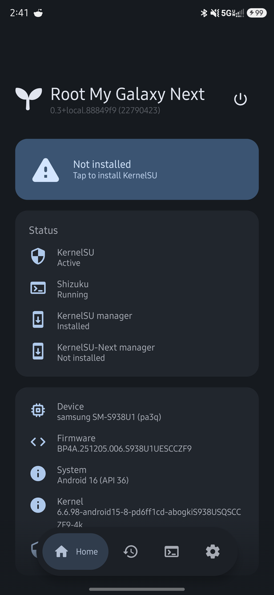
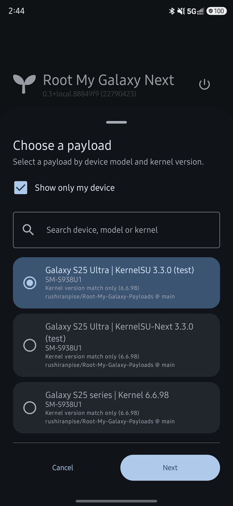
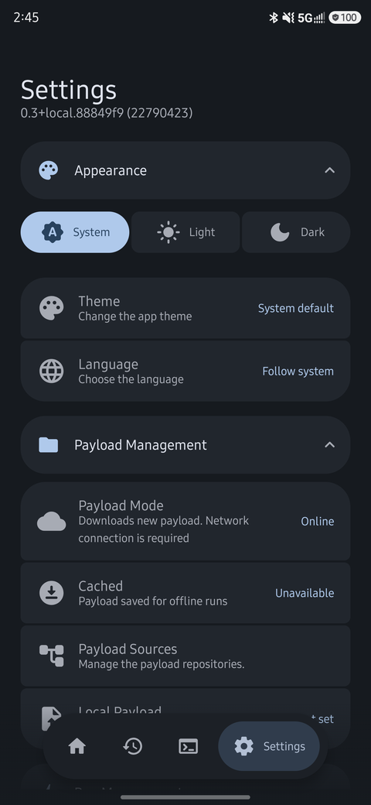
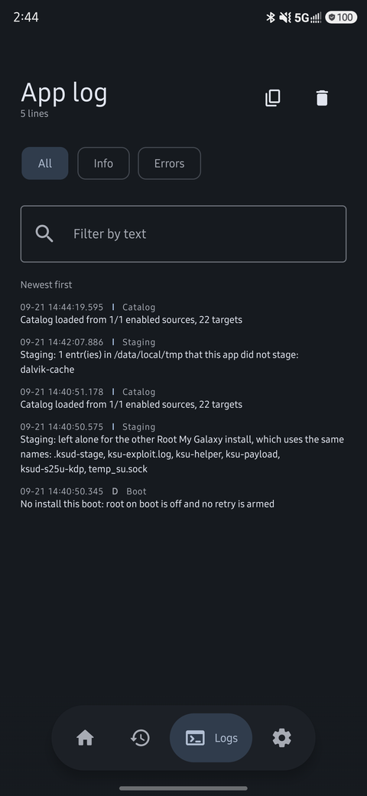

# Root My Galaxy Next


Root My Galaxy Next is a one-click installer for explicitly supported Samsung model and
kernel combinations, and an independent fork of
[Root My Galaxy](https://github.com/BuSung-dev/Root-My-Galaxy) by BuSung-dev. It keeps that
app's device feed, payload contract and KernelSU-first approach, and adds to it: KernelSU-Next
and KernelSU-Next+SUSFS payload flavours beside KernelSU, a choice of manager versions, root on
boot through a verified handoff, wireless ADB pairing as a shell transport, Shizuku started at
boot, a logs tab, filterable run history, and the repair actions once the kernel is loaded.

It installs as its own app (`dev.rushiranpise.rmgnext`), so it can sit beside the original:
neither upgrades the other, and this one starts with no settings, no history and no superuser
grant of its own.


[Latest release](https://github.com/rushiranpise/Root-My-Galaxy-Next/releases)

The device feed and native payloads used here are maintained in
[Root-My-Galaxy-Payloads](https://github.com/rushiranpise/Root-My-Galaxy-Payloads), a fork of
[the original catalog](https://github.com/BuSung-dev/Root-My-Galaxy-Payloads).

## Application

 



From left to right: Home with the live status card, the payload sheet, Settings, and the app log. All
four are this fork's own build, capturing the KernelSU and KernelSU-Next payload flavours it publishes
beside the upstream ones.

The app selects a payload whose model list and three-part kernel version match
the phone. For example, `6.6.98-android15-8-...` matches `6.6.98`. Advanced
mode filters the catalog by both values and allows manual selection with model
and kernel-version warnings.

Each candidate in that sheet also reports how its kernel versions line up with
the phone. Regional siblings share a model and a three-part version, so a
profile that lists this build's full release is marked **Exact kernel release
match** while one that only lists the three-part version is marked **Kernel
version match only (6.6.98)** — the difference between a feed that has tied
the payload to your build and one that has not. The sheet opens preselected on
the exact match when the feed offers one.

The sheet also carries a search box, by device, model or kernel, and a **Show only my device** toggle
that is remembered — with a dozen sources configured it can hold every device its catalogs know, and
the row being looked for is found by name long before it is found by scrolling.

## Build

Requirements:

- JDK 21
- Android SDK 37 (`platforms;android-37.0`)
- Android NDK 28 or newer
- CMake 3.22.1

Point Gradle at your SDK by setting `sdk.dir` in `local.properties`, or export
`ANDROID_HOME` (or `ANDROID_SDK_ROOT`) before building.

### Linux / macOS

```bash
# One-time setup (adjust the SDK path as needed)
export JAVA_HOME="$JAVA_HOME"        # e.g. /usr/lib/jvm/java-21-openjdk
export ANDROID_HOME="$HOME/Android/Sdk"
export PATH="$ANDROID_HOME/cmdline-tools/latest/bin:$PATH"
sdkmanager --install "platform-tools" "platforms;android-37.0" "build-tools;36.0.0" "cmake;3.22.1" "ndk;28.0.13004108"

./gradlew :app:assembleDebug
```

### Windows

```powershell
$env:JAVA_HOME='C:\Program Files\Android\Android Studio\jbr'
.\gradlew.bat :app:assembleDebug
```

Output:

```text
app/build/outputs/apk/debug/app-debug.apk
app/build/outputs/apk/release/app-release.apk
dfr/build/outputs/apk/debug/dfr-debug.apk      # the helper the system-uid flow installs
```

The `:dfr` module builds the helper APK that **Settings → System Management → System UID install**
injects a certificate for and then installs as a system app. `:app` stages that artifact into its own
assets when it is built, so the helper is always the one from the same commit; a helper built on its own
reaches a phone only by building the app. Both modules read the launcher icon from `launcher-icon/` at
the repository root — two APKs sitting in one launcher draw one icon, from one set of files.

Package Manager reads `packages.xml` only when it starts, so both halves of that flow come into force a
boot later: an inject and a clean-up each get their own *restart to apply* step, and the screen works out
which one is owed by comparing the instant it recorded against the app's own clock since boot
(`SystemClock.elapsedRealtime()` — not `/proc/uptime`, which an app domain is denied on this phone and
which failed to zero when it was read that way, making every step look already applied).

## The app's screens

Four pages, one question each. **Home** is what this phone is doing right now: the install card, the
result of the last framework restart when there is one to report, a retry that is armed, **Status** —
KernelSU for this boot, whether this app can use Shizuku, and which manager apps are installed — the
device itself, and then two rows that do something rather than report something: the update check and
About. Its header carries the build label and, in the KernelSU manager's own position, the power button
that opens [the ways out](#restarting-the-phone).

**History** is every run with its log, its stage and the payload source that served it, exportable as a
zip. A filter row above the list narrows it by result — success, root only, failed — and the chips are
built from the history itself, so a result nothing has ever produced is not offered. Deleting asks
nothing and offers an **Undo** instead, because the log is on this phone and the entries are captured
before they go.

**Logs** is the app's own log, read from the file when the tab is opened, with a level row
(**All / Info / Errors**), a text search and a copy button. *Errors* is deliberately **warnings and
up**: a warning is what makes someone open this tab and an error is the same complaint at its loudest,
so a floor at the error level would hide the lines the tab exists to show.

**Settings** is the grouped list below.

## Settings

Settings is grouped by what each setting belongs to, so a decision about Shizuku is not filed under
Appearance and a run option is not filed under Advanced. Each group is a section that can be collapsed
to its heading — consecutive collapsed sections sit in one dense card of headings — and every section
starts open, so the page a fresh install shows is the whole page.

| section | what is in it |
|---|---|
| Appearance | theme mode, material colour, language |
| Payload Management | payload mode, payload sources, cached payload, local payload |
| Run Management | disable KSU modules, protect image partitions, boot settle, run limits, run plan |
| Shizuku Management | use Shizuku, start Shizuku now, Shizuku start token, auto start Shizuku on boot |
| Wireless ADB Management | pair, test, or remove this app's wireless-debugging identity |
| Root Management | KernelSU flavour (a readout of the payload), install KernelSU, manager, manager version, the manager and KernelSU versions this phone is running, auto soft reboot, root on boot |
| Recovery Management | reload modules, restart Zygote, KernelSU soft reboot, reboot and unroot (which also empties /data/adb and /data/local/tmp) — each confirms first |
| System Management | the battery-optimisation exemption a run with the screen off depends on, and what the app has left in `/data/local/tmp` |

The two boot-time settings are filed under their own subsystem rather than together: *auto start Shizuku
on boot* is a property of Shizuku, and *root on boot* is a property of root. **About** and the update
check are not here at all: they are on Home, beside the version they are about.

## Payload sources

**Settings → Payload Management → Payload Sources** opens a bottom sheet that
lists the GitHub `owner/repository` and branch of every catalog the app may use, with a checkbox
per entry to enable or disable it and a delete action to drop it. The sheet is the right shape
for this form: it rises with the keyboard, so the repository and branch fields and their Add
button stay visible on a short screen, where an alert dialog's buttons end up behind the IME. Two feeds are configured by default: this fork's
([Root-My-Galaxy-Payloads](https://github.com/rushiranpise/Root-My-Galaxy-Payloads)) and the official
one it was forked from
([BuSung-dev/Root-My-Galaxy-Payloads](https://github.com/BuSung-dev/Root-My-Galaxy-Payloads)). Both are
read, and every target the picker lists carries the feed that served it — the official catalog is where
this fork's artifacts come from, and it publishes builds of targets this fork has not rebuilt, so
dropping it would leave that half of the list unreachable. Either can be disabled or removed, and
whichever is missing can be restored with one button, so pointing the list at a testing branch for
payloads that are not in it yet does not cost you those catalogs.

Adding a source reads it before it is saved: the repository is resolved to a commit, its
`support/targets-v3.json` is downloaded and parsed, and only then does it join the list, so a
repository that is unreachable, has no manifest, or serves a schema this app cannot read is
refused with the reason instead of becoming a source that fails on every later run. The check
also reports what the catalog covers — the revision it was read at, how many payloads it holds,
the models and kernel versions across all of them, and whether any payload fits this phone,
which is the question a list of models alone cannot answer. Any row can be re-checked with the
check button once more of the catalog has landed, or after the source it follows has moved.
Coverage is kept for the life of the sheet and is not part of what gets saved: a summary of a
branch is stale the moment the branch moves, and a pinned source is how a revision is frozen
rather than a comment about it.

Any source can be **pinned**. The lock button on a row opens a revision picker for that source: the
ref itself (no pin), the repository's tags, and its most recent commits, each showing the commit, the
first line of its message and its date, with the current head marked `current` and whatever the
source is frozen at marked `pinned`. Naming a branch, tag, or commit by hand covers anything not in
those lists, and a tag named there is resolved to the commit it points at now.

**Choosing a revision and pinning to it are two separate steps**, because a pin is the one decision a
catalog cannot take back. Selecting a revision — or resolving a name to one — reads that revision and
shows what it serves: how many payloads it holds, the models and kernel versions they cover, and
whether any of them fits this phone, with the revision named as the revision the summary is about.
The picker then applies it with *Pin* (or *Follow the branch* for the no-pin choice). Opening the
picker starts on what the source is on now, so the first thing shown is what the current pin means.
A revision whose catalog cannot be read still says so and can still be pinned: an unreachable
manifest is not a reason to be unable to move a source off a bad revision. Pinning stores that
commit, after which the source reads from the pinned revision instead of following the branch. That
is what stops a catalog moving under a test, and it has a second effect worth knowing: a pinned
source needs no GitHub API call to load, so it keeps working when the API is rate limited. Unpinning
puts the source back on its ref.

A pinned revision and the branch it came from are two different catalogs, so they carry
different ids and can be configured side by side, which is how a fixed feed and a moving one get
compared in the selection sheet. Pinning is by commit rather than by tag even when the ref is a
tag, because a tag can be moved onto a different commit, which would defeat the point.

A ref is resolved from `github.com/{owner}/{repo}/commits/{ref}.atom` where possible, which is the
same list the repository page shows and is not subject to the sixty-requests-an-hour limit an
unauthenticated REST client shares with every other app on the same address. That limit is what made
adding or pinning a source fail with `HTTP 403` while the repository itself was perfectly readable,
and it is spent by something the user cannot see. The first entry of a ref's feed *is* that ref's
head, for a branch and for a tag alike, so resolution is the same read as the revision list. The REST
API is kept as the fallback, both for the `application/vnd.github.sha` answer and, if that fails
too, in the message: a limited API now says so rather than reporting a status number.

A ref is also resolved to its commit by asking GitHub for `application/vnd.github.sha`, which
answers with the 40-character commit and nothing else. Asking for the commit object instead was
fragile in a way that had nothing to do with commits: that response carries the commit's file
list, so a source whose newest commit touched enough files grew past the app's response limit and
became unreadable — the built-in feed did exactly that. The bare SHA cannot grow. A server that
ignores the requested media type and sends the commit object is still understood, and anything
else is refused rather than trusted.

Each enabled source is fetched on its own: its branch is resolved to a commit, that commit's
`support/targets-v3.json` is read, and every target is pinned to that commit and tagged with
the source it came from. Sources therefore do not shadow one another — when two of them offer
the same payload id, both appear in the selection sheet with their source underneath, and a
source that is unreachable or malformed is reported there and contributes nothing while the
others keep working. Installation only fails when no enabled source yields any target.

Payloads are cached per source, so the same payload id from two sources never shares a
download directory.

Every run records the source it came from and the commit that source was read at, and Run
details shows both. That is what keeps a result traceable after the branch has moved on: the
artifacts were pinned to that commit when the run started, so the revision named in the history
is the revision whose payload actually executed, not whatever the branch holds now.

A target may set `"requiresFreshP0Session": true` in the manifest. Payloads built for a
device whose P0 page address is only valid for the attempt that leaked it must not be
handed the app's cached offset or its attempt/timeout overrides, so marked targets run one
payload-native attempt per run, ignore the cached slide offset, and are left to their own
internal retry pacing. The app's own ceiling for those runs is an hour rather than the fifteen
minutes a cached multi-attempt run gets, because a page scan that has to be won inside a
single session can legitimately take far longer than the retry loop ever needed; the payload's
own limits still end the attempt first. The flag defaults to false, and eight profiles in the
official feed already set it.

A profile may also carry a `"routePolicy"` object, which is where the numbers the app hands a run
come from: `slideRoute` (`default`, `auto`, `tracefs`, or `legacy`/`p0`, passed to the payload as
`SLIDE_SOURCE`), `attempts`, `attemptTimeoutSec`, `p0AttemptTimeoutSec`, and `p0OffsetCache`. The
policy is the single source of the environment, so the run-plan screen, the direct transport and
the Shizuku transport all read the same values rather than three copies of them, and the run log
states the policy it used before the payload starts. Three of those fields — `slideRoute`,
`attempts` and `attemptTimeoutSec` — are the ones a user may replace with the app's own values by
turning on the override in Run limits; the rest are always the profile's. Fields are read one by one with the legacy
value as the fallback: a feed published by a newer workflow must not cost an older build the
target it can use, and one out-of-range number should not either. A profile that is both marked
fresh-session and carries a policy keeps both, because who paces the run and how the payload
finds the slide are different questions: such a profile still runs one attempt with no cached
offset, and still gets its `SLIDE_SOURCE`.

The ceiling is keyed on the profile declaring the flag, not on the kernel version. Kernel 5.15
is a tempting proxy for "this target scans pages", but in the official feed only two of the
four 5.15 profiles ask for a fresh session, and marked profiles also run on 5.10, 6.1 and
6.1.157 — so a version-keyed policy would impose an hour-long single-attempt budget on targets
that never asked for it.

## Local payload

**Settings → Payload Management → Local payload** imports an exploit `.so` built on this device,
for testing against a target the feed does not cover yet. The file is copied into app storage when
you pick it, not referenced by document URI: a run can be started by the boot service, where an
activity's grant on a picked document does not exist, and a persisted URI grant can be revoked
or its provider uninstalled long after the payload was chosen. Importing validates the file —
`.so` name, a 16 MiB cap, and an ELF header read from the copy — and a rejected file leaves the
previously imported payload in place, so a bad pick cannot leave the next run without an
exploit.

While a payload is imported, every run uses it in place of the downloaded exploit; KernelSU
still comes from the source matched to this device, because importing an exploit says nothing
about which `ksud` this kernel needs. The run log names the imported file, and **Remove
payload** returns to downloading the exploit from the enabled sources. Nothing else changes: the
same profile resolution, the same verification of the KernelSU artifact.

An artifact may also carry `"verifySize": false` in the manifest. That is for a source whose
declared size for an artifact is not trustworthy, and it is deliberately per artifact rather
than an app-wide switch: it is the only form of that escape hatch that cannot silently turn off
size verification for every other payload from every source at once. It defaults to true.

The better answer for a source in that position is `"sha256"` on the artifact, the lowercase hex
digest of what it serves. It is verified while the bytes are read, before the file is moved into
place, and it is what a size cannot be: a statement about the content rather than about its
length. An artifact that declares one has its size no longer checked against the manifest at
all, because matching digest already proves the length — so a feed that cannot pin a size can
state a hash instead of switching verification off. An enforced size must also be positive,
which makes a zero a feed error that fails at parse time rather than a download that can never
succeed.

## Payload modes

**Settings → Payload Management → Payload Mode** decides where a run takes its payload from.

**Online** reads the catalog and downloads, so a run uses the revision the sources are on now.
**Offline** uses the last payload that completed a *verified* run, and touches the network not at all:
the catalog is not consulted, because asking it is the thing this mode exists to avoid, so the
selection has to agree with what is cached rather than be resolved against a feed. That applies to the
install screen before a run starts as much as to the run: in this mode the screen names the target the
*cached* payload declares, and a missing cache reads **No cached payload** rather than a support
failure, because nothing about the device's support was ever asked.

A payload is published to the cache only after a run has installed KernelSU successfully, which is
what makes "known good" mean what it says — nothing is written while the exploit is running. The
cached copy is not trusted on the strength of being local: it carries its own descriptor, and every
run re-checks the files against the digests and sizes they were verified with, the device and kernel
the payload claims to support, and the root helper this build of the app bundles. That last one is
the check that matters after an app update: a payload verified against a different helper is refused
rather than run, which is why the cached entry is refused and refreshed rather than silently reused.

Publishing is best-effort and never turns a successful root into a failure; a refusal to publish is
logged with its reason. Nothing clears the cache automatically either — a cached payload that failed
could have failed for any reason, and losing the fallback over one bad run would be the wrong trade —
so **Forget it** in the cached-payload dialog is how it goes away.

## Boot settle

A run does not start the exploit on a device that has only just booted. **Settings → Run Management →
Boot settle** sets the floor, and the wait is measured from the boot rather than from the moment the
run was asked for: a device already past the floor waits not at all, and one rebooted ten seconds ago
waits the rest. That distinction is the whole point — what the gate protects is the state of a freshly
booted device, where the exploit's racy stage fails for reasons the payload cannot fix.

The floor defaults to two minutes and is chosen from `Off, 30 s, 1, 1.5, 2, 3, 5, 10 minutes`; a
value nobody tested is not a better one, which is why the list is fixed rather than free-form. While
the run is waiting it says so on the status card with a countdown that is read from the clock every
tick, so the app sleeping through part of the wait cannot make the run believe it waited longer than
it did. The run plan shows the floor too, beside the other app-side ceilings.

It is a floor, not a rule: the waiting screen offers **Run now anyway**, and the run continues from
there with nothing else changed. Someone who knows this boot has already settled is better informed
than a constant, and the alternative — refusing to run — would just move the same decision to a
reboot.

The automatic install has **its own floor**, under **Settings → Root Management → Root on boot Delay**,
defaulting to one minute rather than two. The two are separate settings because they are waiting out
different amounts and belong to different decisions: by the time the gate runs, `BOOT_COMPLETED` has
already passed and part of the boot is spent, while the manual floor is a setting a person watching a
run adjusts for that run. Sharing one value would mean tuning automation silently rewrote what a
manual run does.

## Run plan

**Settings → Run Management → Run plan** shows what the next run will be handed before it starts:
the target the catalog resolves for this device and which source it came from, whether that
profile needs a fresh P0 session, the transport, the exact environment variables set for the
payload, the arguments only the Shizuku transport adds, whether a slide offset is already cached
for this boot, and the app-side ceilings — silence before a run is treated as stalled, the whole
run, and one helper command.

Every value is assembled from the same constants the run itself uses, so the screen cannot drift
from the behaviour, and it answers "why did the run stop there?" before a boot is spent finding
out. Where a payload is left to its own pacing the screen says so rather than showing an app
ceiling that will not be applied. It also states whether the run will mark the image partitions
read-only, because that changes what the run does before it starts.

**A run has two owners, and the plan says which is which.** The *variables set for the payload* — how
many attempts, how long each gets, which way the exploit looks for the slide — come from the payload
profile in the feed, and the app hands them over rather than deciding them: the profile is the payload's
own account of itself, and it is what every shipped target was validated with. That is the default; the
opt-in override below is the exception. The *app-side cut-offs* are the app's own, and those are
**Settings → Run Management → Run limits**:

| ceiling | what it decides |
|---|---|
| **Whole run** | how long one run may take before the app gives up on it |
| **Silence before the payload is stalled** | how long the payload may print nothing before it is treated as stalled |
| **One helper command** | how long a single helper command may run |

They are the ones worth a setting because they are the numbers a device and a boot change — a cold
device settles late, an overloaded one goes quiet for a while, a slow phone takes longer over every
step — and because their failure is this app's decision rather than the payload's, so a run that reaches
one is reported as a ceiling the user set. They are resolved once when the run starts, like the
transport, so a change mid-run cannot move the point at which that run gets cut off, and the ceilings
in force are the first thing the log states.

The values are offered rather than typed, as the boot-settle floor is: a number nobody tested is not a
better one. **A fresh-session profile is never cut below the app's own hour whatever the whole-run
setting says**, because those profiles hand their pacing to the payload — a single payload-native
attempt that scans pages — and a ceiling *below* that would cut such a run off between its own decisions
rather than at one. The setting can raise that ceiling; it cannot lower it. The stall limit is simply not
applied to one, which the plan says in words rather than showing a value that will not be used.

**The payload's numbers can be overridden, and it is off by default.** The same dialog carries a switch —
*Override the payload* — which puts the app's attempts, per-attempt timeout and slide route in place of
the profile's. It exists for testing a device the feed has not been written for yet, and it is off by
default because it can make a working target fail: those numbers are the payload's account of how it
behaves, not preferences. It covers exactly those three. `p0AttemptTimeoutSec`, `p0OffsetCache` and
`prefersShellTransport` stay the profile's — the first two are its P0 route's own pacing, and the last is
a property of the payload rather than a choice, since a target that needs a shell cannot be told it does
not. **A fresh-session profile keeps its one attempt whatever the setting says**, because that rule is
the payload's requirement rather than a default to outbid; the app's slide route still applies to it,
since how to look for the slide is a different question from how many tries it gets. The run plan names
the side that chose each of the three, so a run testing an experimental number says so on the screen that
describes it.

## The screen during a run

Two writers publish the whole install state: the lookup that decides what this device supports, and
the run. They cannot both be right, and the lookup is the one that cannot be stopped in the middle of
its work — its probe and its catalog fetch do not suspend, so cancelling it takes effect only after
the write it was meant to prevent.

That produced a screen that was live and wrong at once: an online lookup still fetching when an
offline run had already reached the exploit wrote **Not installed / Ready to install** over it, and
replaced the run's own log with the probe it had collected — after which every payload line was
appended to that, so the log kept moving under a card that said nothing was running, and the run
looked stuck.

A claim now decides which writer owns the screen. It is taken before the work and checked before every
publish, and a run takes one on the caller's thread — so by the time a lookup's fetch returns, a run
that has since started has already made its claim stale. The write becomes a no-op instead of a second
opinion.

## One run at a time

A run is one attempt at the exploit, and the app is not one thing: the boot gate installs from
`:autoroot_gate`, a run started from a screen is in the UI process, and that process can hold two screens
with a view model each. Every guard the app had against a second attempt - the screen's own job, the gate's
one-attempt-per-boot claim - was a guard about its *own* process, so a run could be started beside a run,
which is two payloads racing one kernel and one of them overwriting what the other staged while it works.

So a run writes down that it is running, in a form this app's other processes can read, and a start is
refused when that record names a run that is not this screen's own. The record carries three things: the
boot id, the pid, and the **start time** from `/proc/<pid>/stat`. The start time is not decoration - a pid is
handed out again once its process is gone, and this record outlives its process by design, so on a long boot
the number alone would name a stranger and refuse a legitimate run. It also carries the history entry its
owner is writing, which is what lets a reader - the notification, the residue screen's delete, this guard -
tell *which* run is in flight rather than only that somebody is.

The refusal is reported as a failure with no history entry behind it: nothing was attempted, so there is
nothing to record and the next run's history is not this one's. What the card offers is the app's ordinary
three answers, and all three mean something here: waiting until that run finishes, retrying straight away
if it has, or restarting, which takes the device over from it. The boot gate asks the same question twice -
once in its decision, which stands the automatic attempt down without spending it, and once after its settle
wait, since the walk to the phone takes minutes and a run can be started during it.

## What a run does once KernelSU is verified

Two readings of "is root live" are kept apart, because either alone is wrong on this hardware. The
native one is fast — `/sys/module/kernelsu` and `/proc/modules` — and can be hidden by Samsung's
SELinux policy once the modules are loaded: a device with root working perfectly can be reported as
not rooted, which is what makes a boot automation decide a rooted boot needs rooting again. The
second reading asks KernelSU itself, by running `su`: the app is the manager the payload crowns, so
KernelSU's own compatibility layer answers it, and a shell that answers `uid=0` is KernelSU saying it
is live. A yes from either is a yes; a no from both is a no. Positive answers are cached for the
process and negative ones are not, since KernelSU does not unload itself while the kernel is up. The
boot broadcast takes the fast reading only — the fallback starts a process — and the gate asks again,
authoritatively, before it spends the boot's single attempt.

A verified install also grants itself `WRITE_SECURE_SETTINGS` while it still holds the root it just
obtained, over the same post-root shell the rest of the app uses. That permission is
development-flagged and otherwise needs a cable, and it is what lets wireless debugging be turned on
for a later run; without it the wireless transport only works when the user has already switched
wireless debugging on by hand. A grant that does not happen is a line in the log and nothing more: the
root that was obtained is the result, and the cable (or the next boot, which has root of its own) is
still there.

## Two KernelSUs, one at a time

The app drives one KernelSU at a time: KernelSU (`me.weishu.kernelsu`, releases from `tiann/KernelSU`),
KernelSU-Next (`com.rifsxd.ksunext`, releases from `KernelSU-Next/KernelSU-Next`) or ReSukiSU. They are
separate projects with separate kernels, separate managers and separate daemons, and they **cannot both
be in the kernel at once** — each hooks the same syscall paths — so a boot carries one of them or neither.

**Which one is not a setting. It follows the payload.** The flavour decides which daemon a run stages,
which manager is offered and looked for, which releases the version dialog lists, and which module *root
on boot* puts back — every one of those a fact about the KernelSU a payload stages — so the payload that
resolves for this phone is what writes it. The alternative was tried and is the reason for the rule: a
setting standing beside the payload could disagree with it, and setting KernelSU while a KernelSU-Next
payload resolved for this device made the app offer and look for official KernelSU's manager against a
kernel whose only manager is KernelSU-Next's — with nothing on the screen saying so. Deriving it removes
that state rather than warning about it.

Where it is chosen, then, is the payload sheet: its **flavour chips** (Any, KernelSU, KernelSU-Next,
ReSukiSU) narrow the candidate list to the payloads that stage one KernelSU, and the line under them says
what the selected name is. Any is the default and the filter is not stored, because it is a way to find
a payload of a kind rather than a setting — a sheet that reopened filtered would hide the entry somebody
came back for. Picking a payload of another flavour is the override, and it is the only one: there is no
second switch to forget. **Settings → Root Management → KernelSU flavour** is a readout of that decision
("Set by the payload you pick for this device") rather than a picker, and tapping it opens the sheet.

A flavour that differs from what this boot loaded takes effect after a restart, and the row says so with
the reason — which flavour this boot is actually holding — rather than only that a restart is owed,
because "after a restart" on its own leaves the reason to be guessed.

The flavour is the feed's word too, not only the app's. A payload entry declares `"flavor":
"kernelsu-next"`, an entry that declares nothing is KernelSU — which is what keeps every manifest written
before flavours existed readable — and an id that is neither is refused rather than read as the default,
since a manifest that says `"kernel-su"` was written for something and installing the other project's
kernel on a phone that asked for this one is not a repair.

**The flavour narrows the sheet, and resolution still falls back.** A catalog that only carries the
other flavour for this device is still a catalog that roots it — the run takes that payload and the
flavour follows it, rather than refusing to run at all. The run then refuses only the one thing that
cannot work: a load into a boot that already has the *other* flavour in the kernel. That refusal says
which one is loaded and asks for a restart, because the two cannot share a boot.

**The manager version follows the payload, rather than being a number compiled into the app.** An entry
may declare `"version": "3.4.0"` on its `kernelsu` artifact — the release its daemon was built from — and
the app then offers that release's manager, because the daemon a run stages and the manager that talks to
it have to come from the same release and only the feed knows which release that is. The app records it
at the three moments it decides what this device will run — a run resolving its payload, a payload picked
by hand in the target sheet, and the offline cache being loaded — which are also the moments the flavour
is set, so the settings rows can offer it without re-reading the sources. A version typed into the manager field still wins over everything; an
entry that declares none, which is every entry written before the field existed, falls back to the
flavour's own release (3.4.0 for KernelSU-Next, 3.3.0 for KernelSU — the newest each project has
published), and that release is also the only one whose APK file name the app knows, so it is the only
offer that downloads without first asking GitHub for the release. The manager version dialog lists what
the project publishes and marks the one the app offers.

## Loading KernelSU, or not

**Settings → Root Management → Install KernelSU**, on by default. It is the run's last decision
and the only one that changes what a run *is*: with it on, the exploit's bootstrap root is spent on
loading KernelSU and the run is not finished until the kernel's module list, the app's own `su`, or the
helper's control report says the channel is there. With it off, the run stops at the root the exploit
won, loads nothing, verifies nothing, and ends in its own state — *root only* — rather than reporting an
install it did not make. Run history records it separately from a success for the same reason: one says
the device is rooted with KernelSU, the other says the payload worked.

This is our side of the boundary, and it needs nothing from the payload. The helper binary in the feed
is what implements `--late-load` (it execs `ksud late-load` with the package name KernelSU is asked
for); the app only asks for it. Off means the app never asks, so a feed that cannot load anything is
still a feed that can exploit — and nothing is staged either, since a staged daemon exists only to be
loaded.

Everything that consumes the load is switched off with it rather than left to fail:

- **Root on boot** cannot run, because there is nothing for a boot run to put back; the switch is
disabled with that reason on it, and the gate itself refuses with a reason of its own
  (`SkipKernelSuLoadingOff`) rather than looking like the setting had been turned off. The stored
  value is kept, so turning loading back on restores exactly what was there.
- **The recovery actions** — reload modules, restart Zygote, KernelSU soft reboot, reboot and unroot —
  consume the daemon a verified load installed, so the cards read *Needs KernelSU* and take no tap.
- **Disable KSU modules** is inert when there is no load for modules to sit out, so it is disabled
  with that said on it.

The single per-run choice is frozen when a run starts, like the transport, so a preference changed
from Settings mid-run cannot stage a daemon on one reading and skip the load on another.

## Protecting the image partitions

**Settings → Run Management → Protect image partitions**, off by default, marks `boot`, `init_boot`,
`vendor_boot`, `dtbo`, `super`, `optics`, `prism` and `vbmeta` — with their `_a` and `_b` slots —
read-only through `blockdev --setro`, immediately after the exploit succeeds and before KernelSU is
loaded.

What it is for is the shape of this app's own success: bootstrap root is real root, held before
anything has verified that the kernel running is the one the rest of the firmware belongs to. The
reported failures are people using that window to write a boot or vbmeta image — the write that
leaves a phone booting to nothing and reachable only in download mode. Read-only first means that
write fails instead.

Off by default, and not out of caution for its own sake. What it blocks is not only mistakes:
flashing a kernel image from the phone, a module that writes a partition directly, and a KernelSU
install that patches `boot` instead of loading at runtime all stop working while it is on, and
nothing in the app can tell those apart from the mistake. The flag is also per boot — it affects the
running kernel — so a reboot, the normal state for flashing, clears it, and download-mode flashing is
unaffected because that runs in the bootloader rather than in this kernel. The run log says how many
devices were set, or that the script was missing from the build, rather than reporting protection it
did not get.

## When a run fails

A failed run names the stage it stopped in — starting the transport, resolving the payload for
this device, downloading the payloads, running the kernel exploit, loading KernelSU, or verifying
the control channel — reports the reason the app itself reached, and shows the last lines the
payload printed. The stage matters because the same wording can come out of a download, the
exploit, or the KernelSU load, and only some of those are worth retrying straight away; the payload
tail matters because the payload is the only account of the kernel race, so a failure that is not
the app's own decision is otherwise unexplained.

A payload that was killed rather than exiting is reported as the signal that killed it — `137` is
read back as `signal 9 (SIGKILL)`, because that is the one thing a status can say about a payload
that died without choosing to — and the reason is reduced to a single short line before it reaches
the card. The payload's own words belong in the log and, clipped to the last few lines, on the
failure card; a message that carried them instead once turned the card into a page of text with the
stage nowhere in sight.

The stage and reason are stored with the run, so a failure from a previous boot still says where
it ended, and the full log stays attached to the run for export. An unattended run at boot has the
stage in its notification title, since that notification is the whole of the explanation available
when nobody is looking at the screen.

Two things on that screen are placed by the failure rather than by the phase:

- **The steps card marks the step that failed, and the ones before it as done.** It used to put the
  *first* step in progress for every failure, so a run that died in the kernel exploit showed "Support
  check" as the step in flight and no mark at all on the exploit — the two questions the card exists to
  answer, both wrong. When the stage is not known, nothing is claimed rather than guessed at, because a
  card with no marks is better than one pointing at a step that may not be the one that stopped.
- **The progress bar stops where the run reached** instead of resetting to empty with the failure, since
  how far it got is still true and still useful.

The log panel has a height of its own rather than the space left over. As the remainder it was measured
at zero text height on a run that failed in the exploit: the panel showed its title and its copy button
over empty space, with the run's actual output sitting unread in the state behind it. The page scrolls
instead, and the log keeps enough room for the tail that says why the run stopped.

One failure is not the exploit's judgement but the kernel's budget, and it is reported as its own
cause. The race is built on a pipe buffer whose pages are charged to the user's pipe page budget
(`fs.pipe-user-pages-soft` and `-hard`), and that budget is **per boot, not per process**: an attempt
that spends it leaves the next one unable to allocate at all, so the symptom is a phone that "stopped
working" after one failure rather than a run that failed once. The payload reports it as a refusal on
its sizing call — `F_SETPIPE_SZ` beside `EPERM` — and the diagnosis is read from those two facts in the
*same line*, never from either alone: a payload also prints its pipe limits as ordinary information, and
a diagnosis that fired on those would send someone to restart a phone with nothing wrong with it.

A spent budget is remembered for the boot it was spent in, keyed to the boot token rather than to a flag
something has to clear, so a restart ends it without anything having to remember. The next run then
refuses before it waits or downloads anything — before the boot-settle floor, deliberately, since
settling for minutes only to be refused is the wait the refusal exists to save — and offers a restart as
the answer instead of another attempt.

## After a run ends

**A successful load ends with a step to take rather than only a result to read.** KernelSU's modules are
mounted by the load, but they do not enter the apps that should see them until the userspace is built
again — so the run screen offers **Restart userspace to load modules**, which is KernelSU's own soft
reboot asked for from the screen that has just finished, at the moment that decision is being made.
**Settings → Root Management → Auto Soft reboot** takes it for you: with it on, a run that loaded
KernelSU asks for the soft reboot itself, after the result has been written, because the restart ends
everything the process is in the middle of. A refusal there is a line in the log rather than a failure,
since the run has already succeeded. It is on by default, because a load whose modules nothing has picked
up yet is not a finished job; the restart closes whatever is open, so it can be turned off.

**A failed run offers a choice rather than one retry button**, because the boot's single attempt has just
been spent and the three answers do not have the same odds:

- **Restart and retry** — the best odds, and the only one that changes the state the payload failed on: a
  clean boot, and the install runs by itself afterwards. It is armed on disk *before* the reboot is
  requested, because the reboot can beat an asynchronous write and take the decision with it, and because
  that is what makes a refused reboot recoverable: the user restarts by hand and gets the install they
  asked for either way. The boot it was armed in is recorded with it, so the same boot cannot consume it.
  It runs **the payload that failed**, not the cached one — a retry is a request to run that payload again,
  and on a device somebody is testing on, the cached payload is a different one. A pending retry is shown
  on Home with the payload it will run and a way to cancel it, and it takes precedence over *root on
  boot*, which is exactly why it is shown rather than left as a hidden one-shot.
- **Wait, then retry** — in the same boot, after a minute, with the countdown on the screen. A failed
  attempt leaves the payload's own oracle and slab state behind and spends part of the shell user's pipe
  page budget, so a second attempt made straight away tends to fail on that state rather than on the
  exploit. The minute is a measurement rather than a guess: two independent projects that drive this
  payload recorded the same observation, that the state clears itself in about that time.
- **Retry now** — the fastest of the three and the least likely to succeed, and labelled as such.

Two things take the wait away instead of offering it uselessly: a boot whose pipe page budget is spent,
where only a restart refills it, and a payload that may still be running, where starting a second one can
lock the phone up.

## What the app leaves on the device

The daemon, the helper and the exploit have to be executable by a shell, and `/data/local/tmp` is the one
directory that is both writable by the transports this app uses and outside the app's own sandbox — so
the app stages there, and the staging is *public in the way that matters*: the directory is mode `0771`,
any app on the device may reach a path inside it by name, and the files themselves are world-readable. A
detector needs no root and no shell to find them; it needs the names, and the names this app uses are
fixed and published in its own source. The system-uid flow leaves its own files in `/data/system` instead,
which is the same problem the other way round: no app on the phone can read that directory at all, and the
two files an inject leaves there are a copy of the package database and the daemon the helper stages.

**Nothing deletes itself.** A run used to end by sweeping what it staged, and every launch used to sweep
again for the runs that never got that far; both are gone. Deleting is now a thing a person asks for,
from the screen that lists what is there. The automatic version was not wrong about the facts, it was
wrong about who decides: `/data/local/tmp/ksud-s25u-kdp` is read by the payload during a run and by
nothing afterwards, which is a fact about a *moment* — and the sweep that ran after a failed run was the
one that could take a file a retry was about to use. The last straw was the system-uid flow's own two
files in `/data/system`: a pre-inject copy of `packages.xml` is a rescue, and an automatic clean-up threw
it away as part of a button whose name said nothing about it.

Deletion still needs a shell — KernelSU's `su`, or the `shell`-uid server Shizuku provides, whose uid
*owns* the temp directory and is the only reason deletion there is possible at all, since the app's own
uid may not write in it. A device with no shell deletes nothing and says so; the files stay listed.

**The reading.** **Settings → System Management** carries a *Residue* card opening a screen with three
folders, because one directory was never the whole picture:

- **`/data/local/tmp`** — the shared temp directory, mode `0771`, reached by any app on the phone by
  name. Read from the app's own context as well as through a shell, because a shell reading answers "what
  is on disk" where the interesting question is what another app can see. The `--x` on the directory is
  what makes the check a name-by-name `stat`: an app may traverse it and may not list it. Those names
  come from the same constants the staging code uses, and that alone was the first version's whole
  answer — wrong in the direction that matters, because a name the catalog does not know — a payload's
  own log, a marker written by a script — left the card reading *Nothing left*, which is the same
  sentence as a clean device and the opposite of the truth. So the catalog is stat-ed and the directory
  is *listed* as well, with anything the listing names that the catalog does not carried as an extra.
- **`/data/system`** — root-only, which is exactly why the system-uid flow works there: the daemon the
  exploit execs, the second copy the helper stages *from* (that helper runs inside `system_server`, whose
  context may not read the shell's temp directory, so the daemon is left for it here rather than in
  `/data/local/tmp`), and the inject's own copies of `packages.xml`. Read by name from a catalog rather than
  listed, because the directory holds hundreds of files belonging to the platform and to every app.
- **`/data/adb`** — KernelSU's own. Listed, and never deleted from: everything in it is the root this app
  has just obtained, so no row there has a delete button, and neither does the folder.

Nothing found is reported as absent when it could not be read: an entry that cannot be stat-ed counts as
present and is shown as *not readable*, and a directory that could not be listed says that rather than
reading as empty. That distinction is the point of the screen — "nothing there" and "not allowed to
look" are opposite answers, and a detector's finding is usually checked against this list.

Each folder is a **closed heading** that carries what it holds — a count and a size, or the sentence its
empty reading earned — and opens on a tap. Closed is the default because a list drawn in full puts the
directory a detector found something in below the two that are clean. Inside, a row's own delete removes
that one file; the delete in a folder's heading removes everything in **that folder only**, confirmed
first, by whichever route the folder allows: the temp directory is emptied by glob, `/data/system` by
naming the paths the catalog lists. **Delete All** at the bottom of the screen is the wider action, which
is why it is asked for and confirmed.

## KernelSU readiness

**Home → Status** puts the facts a run depends on on the screen the app opens on — *is KernelSU loaded
in this boot*, *can this app use Shizuku*, and *which manager apps are installed* — read live rather
than from a snapshot. KernelSU is loaded per boot, so the row is about the current boot and not the
device's history: a phone rooted yesterday reads as not loaded, which is exactly why root on boot
exists. The manager rows are the other half of that question, because a run can install a daemon
without the manager app being present and the manager is what the app then opens to grant itself
superuser; they are named per flavour because the two projects ship different packages and each flavour
looks for its own. Every row opens Settings, because a state that is wrong is something to fix and not
only to know.

Both answers are two-valued at best and the KernelSU one is **three**: `Loaded`, `Not loaded`, or
`Could not be read`. That third state is the point. The readings behind the row are the ones Samsung's
policy denies to app domains, so "could not look" is a real outcome; reporting it as "not loaded" is the
bug that once had the app call a rooted phone unrooted, and a status line is where the temptation to
collapse it is strongest, because it wants a single word. A yes comes from either source (the native
probe or `su`, and the kernel's module list, which is evidence even when no shell of ours can run); a no
needs a reading that actually looked, which in practice means the module list; with neither, the row says
so.

A successful `--late-load` says the command finished, not that KernelSU is reachable afterwards, so
the run states which independent reading confirmed the control channel instead of taking the exit
code for it:

- the in-process native probe seeing KernelSU from the app's own process;
- KernelSU's own `su` answering through the running Shizuku server, which also proves a usable root
  shell;
- the helper's control report — `KernelSU control verified version=… flags=0x… uapi=… features=0x…`
  — with a version of zero or a `control check failed` line deliberately not counting as one.

One reading is enough, and the log line names the ones that answered. A manager app that was open when
the load happened is stopped rather than left to confuse the two: a manager reads the kernel when it
starts, so one that was already running keeps showing what it read *before* the load — no root, no
modules, "KernelSU not installed" — which is the same picture as a load that failed and is the report
this app keeps being handed when the load worked. It is deliberately not relaunched, because pulling
another app to the front the moment a run finishes would take the screen away from the result being read;
the stale state is cured by the next open either way. A run of the old kind — the
helper exited cleanly and nothing answered afterwards — is now reported as `KernelSU loaded but no
control channel answered` rather than as a success.

**Control is not the same contract as the modules**, and the two are kept apart deliberately. A run
needs control; anything that *repairs or reloads modules* has to check its own mount result, because
KernelSU being reachable says nothing about whether an enabled module is mounted. That check cannot be
made from wherever a command happens to run: module mounts are per mount namespace, so the probe
compares init's namespace with its own and enters init's through `nsenter` when they differ — the same
reason a userspace transition has to be asked of init rather than performed from the app. What should
be mounted is counted from the module directories themselves (enabled, not marked `remove`, carrying a
`system` overlay), so installing or disabling one changes the expectation without this app knowing
which modules exist.

That reading gates **Restart Zygote**, whose whole purpose is to make already-mounted modules take
effect: with modules enabled but unmounted it is refused in words, rather than taken the framework
down and back without them. Only a positive finding refuses — an unreadable namespace or an
unreadable report is reported and allowed, because refusing whenever a check cannot be made would
make the action unusable on the devices that cannot make it. The child re-runs the same reading, so
the decision holds where it is actually taken. Privileged maintenance that runs *after* root
(the module directory move and restore) asks KernelSU for a root shell first and only falls back to
the helper's temporary handoff socket: a Samsung kernel may refuse new connects to that socket while
KernelSU itself is perfectly healthy.

## Shizuku without a computer

Shizuku is what this app runs the payload as shell through, and it is normally started by hand over
adb — so after a reboot the transport is gone until someone finds a cable. Once KernelSU is on the
device that is unnecessary: KernelSU's own root shell can run Shizuku's starter, which is what
**Start Shizuku now** and **auto start Shizuku on boot** in Settings do.

That row reports Shizuku's state rather than being a command it hopes still applies. It has three —
*not running*, *running without this app's permission*, and *ready* — and they are not two, because
**running and usable are separate facts**. The row used to have neither: its only signal was whether a
start attempt was in flight, so a running Shizuku looked exactly like a stopped one, and a tap on a
service that was already up produced a dialog saying so — the row's own missing state, delivered to one
person, once, instead of shown on the screen. It now reads the state live through Shizuku's own sticky
binder listener (which fires immediately with the current state, not only on the next change, because a
snapshot taken while the screen is being built can predate a binder that is already there), re-reads the
permission before acting since Shizuku offers no callback for a grant this app did not request, and then
offers the one action still worth taking: start it, ask for the grant, or nothing at all.

**Use Shizuku** above it reads the same state, which is what stops the switch from describing something
the device is not doing. Enabling it used to ping the binder for up to three seconds and then guess from
the answer — the same race with a longer fuse — and it stored the preference *before* asking for the
permission, so a refused prompt left the app preferring a transport it was not allowed to use, with a
switch saying that preference was on. The state decides now: running and allowed stores it, a missing
grant is asked for and stored only if it lands, and no service at all says so instead of storing a
preference that cannot work. The preference itself is never rewritten behind the user's back — a grant
revoked in the Shizuku app does not silently clear it — but the row says what is true from then on,
because the state is re-read every time the screen comes back: that third way the answer changes is the
one Shizuku sends no callback for, and revoking does not kill the binder either.

- Current Shizuku builds expose their starter as a native library inside their own APK, run with the
  path of the APK it belongs to; older or manually installed builds may have dropped a `start.sh` on
  shared storage. The native route is preferred, the legacy script is a fallback, and a device with
  neither is reported once rather than as two failures.
- The start is serialized across the app's processes — a file lock, not a mutex, because the boot
  service, the settings screen and the automatic install are three different ones — and re-probes the
  binder immediately before every launch, because a start racing the Shizuku app's own or a previous
  boot's attempt otherwise looks like one that never took effect. A binder that appears during a probe
  is reported as already running, not as a failure.
- **A device with no root has two routes left**, and neither needs a computer.

  The first is this app's own adb identity: **Settings → Wireless ADB Management → Pair** once, and from then on
  the app can run *Shizuku's own starter* in the shell the device's adbd hands out — the same
  `libshizuku.so --apk=…` (or legacy `start.sh`) that root would run, just in a different shell. It
  is the route with the fewest dependencies of any of them: no root, no cable, another app's
  cooperation is not needed, and **no network**, because the connection to adbd is to `127.0.0.1`
  (see [Wireless ADB](#wireless-adb)). The app can see the process it started, so the result is
  checkable in the same way root's is, and it is preferred over the token route for that reason.
  Wireless debugging is turned on for the attempt and off again after it, the same window a run
  gets.

  The second is opt-in and is a request rather than an act: if your Shizuku build accepts
  authenticated start requests, store the matching token under **Settings → Shizuku Management → Shizuku start
  token** and the app will ask the Shizuku package itself to start. The broadcast is package-scoped,
  the token is only ever sent to that package, and it is never written to the log or to run history.
  It is last because the app cannot verify it — and because on a build whose own start method is
  wireless debugging, the thing it waits for is a wifi connection this app cannot supply.

  **A failed start now says which route failed and what each one found.** The result line alone was
  not enough to act on: three routes with three different fixes all ended in the same "Shizuku could
  not be started", which reads as nothing having happened — and on this device it *was* something
  having happened, a paired adb route that found no port and then handed the job to a route that waits
  for wifi. The dialog carries the attempt's own lines, capped and scrollable, so the last one names
  the step that stopped it.

  With neither, the app says no root, no pairing and no token are why nothing can be started,
  instead of sending a request it cannot authenticate and reporting Shizuku's refusal as a failure.
- On boot the start runs after a settle delay, by whichever route the device has: root when it is
  there, the app's own pairing, and the stored token as the last resort. The boot trigger sits before
  the boot's root checks rather than inside them, because those two no-root routes are precisely what
  a boot without root can take — and a boot with none of them is left alone rather than told once per
  reboot that nothing can be done. Retries are for the root route only: a root starter races a system
  that is still settling, where a start request has already been delivered, so sending it again asks
  the same question twice. A boot-time install that succeeds starts Shizuku too, because the boot
  that has to re-establish root is exactly the boot that can then bring Shizuku back.

Root is always preferred when it exists, because the native starter's result can be checked while a
request to another app can only be answered by waiting for a binder. If your Shizuku build starts
itself on boot, the app notices and reports that rather than racing it. Switching the setting on
starts Shizuku there and then, so the setting is proven on the device instead of at the next reboot.

## Which transport a run uses

A run's payload goes through one of three transports, and the choice is frozen when the run starts so
a preference changed mid-run cannot mix them between the exploit and the KernelSU staging:

| transport | used when |
|---|---|
| Shizuku | it was asked for and it is answering — preferred over a pairing, because the pairing path turns a device setting on and off around itself and this one does not have to |
| Wireless ADB | the payload needs a shell and Shizuku is not available, and a pairing is stored |
| The app's own process | the payload does not need a shell and nothing else was asked for |

The two rules that matter:

- **A payload that needs a shell never falls back to the app's own domain.** The feed says the target
  only works from a shell — a route that reads tracefs, or that stages itself outside the app's
  directory — and running it as the app anyway fails for a reason that looks like the payload's fault.
  When neither shell transport is available the run refuses, and the message names both: whether
  Shizuku is off or switched on but silent, and whether a pairing is stored. Those send you to
different places, so they are different messages.
- **Wireless ADB runs the payload in one open shell, streamed.** adbd kills a backgrounded process the
  moment its shell closes, so a detached payload would be killed at the start while the run waited out
  its whole ceiling for a process that no longer existed. The transport also carries the exit code
  itself — the raw `shell:` service does not — so "the payload failed" and "the payload finished and
  the run got nothing" stay different outcomes.

A profile opts in through its feed entry (`routePolicy.prefersShellTransport`), which is why the run
plan states it: the line now reads `shell=required` or `shell=optional`, so a refusal for want of a
transport is visible before a run is started rather than after it fails.

## Wireless ADB

Every other transport this app has can be absent at the worst moment. A Shizuku binder needs root or a
computer; the bootstrap helper's socket only exists in the window it was staged in. The device's own
wireless debugging is different: it is a shell the user can enable from Developer options, with no
cable and no root.

**Settings → Wireless ADB Management** pairs with it. It does two jobs, and both are the same connection: it is a
transport a run can use when Shizuku is not available, and it is a shell this app can run *Shizuku's
own starter* in when there is no root — which is how a device with no root and no cable gets Shizuku
back after a reboot.

One detail decides whether either job needs a network. The connection is always to `127.0.0.1`, and the
port is read from the system property adbd sets when wireless debugging comes up (`service.adb.tls.port`)
*before* anything tries mDNS — so **on a device that has paired once, neither job needs wifi at all**:
the device is talking to its own adbd over loopback. What does need a network is the *pairing* itself,
where the port is only published over mDNS; that is a one-time step done by hand with Android's own
pairing dialog open, and the key it leaves behind survives reboots.

Pairing is three steps on adbd's side — a TLS 1.3 session
whose exported key material joins the pairing code to form the password, a SPAKE2 exchange that proves
both sides hold that password without sending it, and an encrypted PeerInfo carrying this app's public
key — and the code itself is entered **in the notification** the app posts, because the code is shown
in Developer options and switching apps to type six digits would be the whole cost of the feature.

The transport is treated as a window, not as device state: wireless debugging is turned on for the run
that needs it and off again when the pairing or the session ends, with an alarm armed *before* it is
turned on so a process killed in between still turns it back off.

The window only restores what it changed. A device already running wireless debugging for the user's
own adb session has nothing to restore, and switching it off there would end a session this app was
never asked to touch — so the switch is marked as the app's when the app moves it and left alone when
it does not. The mark is persisted rather than held in memory, because the failsafe alarm fires in a
process that may not be the one that flipped the switch.

**Turning it on is verified, not assumed.** `Settings.Global.putInt` returns without complaint whether
or not the device honours the value, so a write that changed nothing used to look exactly like one that
worked — and the app then searched for a port for up to a minute on a device where no listener had ever
started. The setting is now read back: **on**, **refused** (written and it did not move) and
**unavailable** (no permission and no root) are told apart, and so is **unreadable**, which is its own
answer because the reads are exactly the ones a device may deny this app. A refusal says to use the
switch in Developer options; an unreadable setting is tried anyway rather than called off, since the
port is the authority then.

Two things are kept apart on purpose, and the screen says which one you are looking at:

- **A stored pairing is a record, not a state.** The device can forget this app at any time, and
  nothing on this side changes when it does — so the card reads *paired, unverified* until **Test the
  connection** has actually connected and come back with a shell identity. Only that reads *working*.
- **Failures are separated by what they need.** A refused certificate means the device no longer knows
  this app, which is what **Pair again** is for: it clears the app's key and recorded pairing first,
  because retrying with a key the device has already discarded looks like a no-op. A missing port means
  wireless debugging is off or adbd has not published one yet. A connection failure is neither.

Turning wireless debugging on from the app needs `WRITE_SECURE_SETTINGS`, which is granted to a rooted
device (`pm grant`) or at install time (`adb install -g`). Without it the transport still works
whenever the user has wireless debugging on already, and the card says so rather than pretending
otherwise.

**Starting a pairing takes the user to the screen the code comes from.** The six-digit code is
generated by Android's own pairing dialog, which only exists in Developer options - so naming that
screen, which is all a notification can do, asks the user to find Developer options, then Wireless
debugging, then the right entry, from memory, while the code expires. Tapping **Pair with a code**
now opens Developer options directly, and the notification carries the same door as a tap and as an
**Open Developer options** action, on both the searching state and the outcome, because a refused
pairing is usually "the dialog was not open".

The opening is a chain, tried in order, and this is the one place in the app that has to guess at
another package's layout. `android.settings.APPLICATION_DEVELOPMENT_SETTINGS` comes first, then the
Samsung dashboard class, then the AOSP one, and **Settings itself last** - so a build with none of
them still lands one screen away rather than nowhere. Nothing is checked before it is launched:
package visibility would let a "no" be said about a screen that would have opened. The chain is also
why a notification tap goes through a broadcast receiver instead of an activity pending intent - a
pending intent carries one immutable intent, which is exactly the entry a build without that screen
would refuse.

Pairing also turns wireless debugging on itself when the device lets it, because a pairing service
only exists while it is on: the same window a run uses, failsafe alarm armed first, switched off again
by the pairing service when the transaction ends. Where neither the permission nor root exists, the
app hands over the switch by hand - which is what opening Developer options is for.

## Root on boot

These targets are rooted by loading KernelSU into the running kernel, so root does not survive a power
cycle by itself: every boot has to load it again. **Settings → Root Management → Root on boot** makes that
automatic, and it is a gate rather than a fire-and-forget broadcast.

The gate runs in its own process (`:autoroot_gate`) because it outlives the app process it starts in —
which is exactly what happens at boot — and it decides whether this boot gets an attempt before doing
anything else. Its rule is one pure function, in this order: the setting is on; KernelSU is not
already answering; an install has not already been *verified in this kernel boot*; this boot's single
attempt has not been spent; and a verified payload is cached. Only the last case asks anything of the
user, and it asks once.

Two of those are about telling boots apart. A userspace restart re-emits `BOOT_COMPLETED` while the
kernel stays up, so the boot id — not the event, and not a timestamp — is what decides, and an install
verified in this boot stays verified across it. The attempt is claimed before the run rather than
after, so two components racing one boot cannot both spend it.

The run itself is the same code the install screen drives, started with the cached payload and the
standalone transport: an automatic install cannot drift from a manual one. It is bounded the whole way
— the wait uses its own shorter boot-settle floor (the manual one is a separate setting),the run keeps its own cut-offs, and the
gate has a deadline of its own — and it reports through the notification it must show anyway,
including which stage a failure stopped in. Failures are recorded in run history like any other run,
and the notification's *Skip install* action is how one is stopped without opening the app — the run
in front of you, not the setting: root on boot keeps its value, and the action on a boot that is
honouring a retry is the same one under the name *Skip retry*, which takes that request back too.

Because it runs unattended, nothing in the gate is allowed to take its process down: the wake lock it
holds for the duration is best-effort, and the whole gate is wrapped so an unexpected throw reports
itself through the notification instead of crashing after a reboot. Neither is decoration — an
ungranted `WAKE_LOCK` throws at the acquire, and the acquire sits *outside* the gate's own error
handling, so the first version of this crashed one second after start-up and left nothing to read.
`ManifestPermissionTest` now fails the build when code asks for a permission the manifest never
declares, which is the general shape of that mistake.

One deliberate difference from the reference: after a successful boot install it starts Shizuku when
*auto start Shizuku on boot* is on, and does not restart the Android runtime by itself. A zygote restart
closes whatever is open, which is a decision for the person using the phone — *Restart Zygote* in
Recovery Management is the same action with a finger on it.

## Post-root repair

A rooted boot can come up unusable — a module that breaks the framework, a mount that needs the
runtime recreated, a state worth getting out of — and until now the only answers were a reboot or a
cable. **Settings → Recovery Management** has four actions, and each one asks before it runs: the card
opens a dialog naming the consequence — everything open will close, or root will be gone — and the
dialog's own button starts it. A hold was the older confirmation and it was the wrong one for a card
that reads like a button: a hold is invisible until it succeeds, so nothing on the screen said the
cards behaved differently from every other row in Settings, and a dialog can state the cost in words
that a filling bar cannot. The cards are also the only ones whose taps do not reach the action they
name, which is the point.

- **Reload modules** runs KernelSU's own module setup again through the installed daemon — the same
  shape of change as a load, for a boot where a module was installed or enabled and what is mounted
  behind it is stale, and the screen someone reaches for when the manager says the modules are not
  there. It is the one action here that stages a daemon of its own, and it stages the *installed* one:
  `/data/adb/ksud` is copied to `/data/local/tmp/.ksud-stage` and the action is refused unless the two
  hash the same, so nothing from elsewhere can be run in its place. A manager that was open while the
  reload happened is stopped afterwards rather than left showing the state from before it.
- **Restart Zygote** recreates the Android runtime through init — `setprop ctl.restart zygote`, which
  asks init to restart the service it owns, where killing Zygote from the app would leave init to
  recover by accident. The secondary Zygote, when the device runs one, goes first, because it can be
  restarted without the framework going down and so a failure there is still reportable. It waits for
  two things first, and refuses in words rather than taking the framework down for nothing: the
  modules it is meant to load have to be **mounted** (see [KernelSU readiness](#kernelsu-readiness)),
  and the modules that inject *into* Zygote — Zygisk Next's `zn-daemon` and LSPosed's `lspd`, each
  only when its module is installed and enabled — have to be **running**, because a Zygote created
  before those services come up returns without them. That wait is bounded, and the app's own window
  is **sized from that bound** rather than set beside it — a wait counted in iterations and a window
  counted in seconds are the same thing only by accident, and here they disagreed: ten seconds of
  polling against a twenty-second wait, so a refusal that had already been written was reported as
  silence, and the child went on to act after the app had stopped listening. Whichever module is
  missing is named in the refusal too, because that is the child's own reading and the sentence around
  it is the app's.
- **KernelSU soft reboot** hands the transition to the installed `ksud`, whose own command table
  lists `soft-reboot` as *Emulate system reboot*: it stops and restarts the userspace and walks the
  module lifecycle in its normal order. It takes a per-boot lock carrying the boot id and the owner's
  pid, so a second request in the same boot is told the first already owns it rather than racing it —
  and a lock whose owner is no longer running is taken over, because a keeper killed mid-transition
  would otherwise lock the boot out of every later attempt. The card is offered only when the
  installed daemon's own help lists the command, since a feed may serve a daemon without it;
  whole-token matching keeps the `emulated-soft-reboot` marker in that same binary from counting. A
  daemon that did not return is stopped, and its last line is what the failure quotes, so the cause
  comes from KernelSU rather than from us.
- **Reboot and unroot** clears *root on boot* first and then reboots, because a reboot that happened
  first would come back rooted; if the request is refused, the setting is put back and the screen
  follows the stored value rather than the value it hoped for. The reboot is only half of it: KernelSU
  lives in the running kernel and its *modules*, *superuser grants* and *daemon* live in `/data/adb`,
  and every root solution on the phone writes into the shared `/data/local/tmp`, so both directories
  are **emptied** — contents only, since KernelSU and init created them with modes the platform relies
  on — in the same action, while there is still a root shell to do it with. That is the last chance:
  after the restart nothing here can be deleted any more. The wipe runs first, then the account of it
  is published and read, and only then does the child restart, so an accepted outcome is never a
  promise about work that has not happened. Entries that survive — a file in use, an immutable
  attribute, or anything out of reach of a shell that is not root — are **named in the report** rather
  than treated as a failure: a restart with one busy file left behind is still the unroot that was
  asked for. The one thing the wipe will not do is delete *through* a mount: a leftover bind mount from
  a run is detached lazily first, and if it is still mounted it is reported instead of removed.

Three of them need a root shell, and there are two ways to get one: through Shizuku when it is running
and has granted this app, and otherwise by asking KernelSU's own `su` directly, which needs nothing else
on the device. The direct route is the fallback — Shizuku first keeps the quiet path the common one — and
it is what makes these cards usable on a phone that has root but no Shizuku. The fourth, *reboot and
unroot*, is the one a plain shell can also do: the `shell` user holds the reboot permission, which is how
`adb reboot` works, so that path asks through `svc power reboot` and the privilege check becomes the
platform's rather than this script's — with the app's own *root on boot* setting cleared before the
request exactly as the root path does. Because the routes fail for unrelated reasons, the refusal says
which one it was: **KernelSU is not loaded in
this boot** (nothing to run anything with; run the install), or **KernelSU is running but this app has
no root shell** (grant it superuser in the KernelSU app, or start Shizuku). Reporting the second as
the first is how the cards came to tell a rooted phone it had no root.

Under the direct route a `su` that is waiting for the user to answer KernelSU's own grant prompt has
printed nothing yet, so its output is read on its own thread and the wait is bounded — `su -c` also
must not be trusted for an exit code alone, since both routes require the `uid=0` as well.

None of it acquires bootstrap root or replays the exploit: they consume the root the verified load
installed. One of them stages a file — the module reload's copy of the *installed* daemon — and nothing
here stages the exploit or the feed's helper. Each action runs its real work in a detached shell that
checks for itself that the boot id has not changed under it, that it is root where root is required, and
— for the restart — that Zygote is actually running, and then writes an acknowledgement the app reads
back. A successful fork
is deliberately not an action: an action the child did not acknowledge is reported as a failure,
because the app must never call something scheduled that never happened. The child's own worst case
is bounded to stay inside the window the app waits in — the window is derived from it, so the two
cannot drift apart — and **being written down is not being heard**: the app removes the
acknowledgement as it reads it, so the child checks that it is gone before doing anything
irreversible. An acknowledgement still sitting there means the app gave up or died, and a framework
restart or a reboot after the user has been told the action failed is the worst version of this bug.
The reverse cannot happen either — a daemon that has not returned is stopped and reported rather than
left to fire a userspace transition the app already gave up on.

## Restarting the phone

The power button in Home's header opens **Restart the phone**: the same six ways out the KernelSU
manager's own power menu offers, in its order — Reboot, Soft restart, Recovery, Bootloader, Download and
EDL. A way out of the running Android is not a setting, which is why it is on the screen someone is
looking at while holding the phone.

Which of the six this device will do is decided on each row rather than assumed, because it depends on
what answers *right now*. A root shell can ask for all six. The plain shell a Shizuku server offers is
uid 2000, and `shell` may reboot the phone — that is how `adb reboot recovery` works, with the target
travelling as the command's own argument, so every reboot here survives the loss of root. The daemon's
own soft restart is the one that needs root, because it is not a reboot request at all. A row that cannot
be asked for is greyed with the reason on it, and the two reasons are kept apart because their fixes are
different: **root is required**, or **there is no root or Shizuku shell to ask with**.

**The four that leave Android are confirmed first.** Recovery, Odin, download and EDL are places the phone
does not come back from by itself, and the confirmation says how to get out of them: Power and Volume
Down together for seven seconds. A plain reboot is not confirmed, since it asks for what Android's own
power menu already offers, and neither is the soft restart — it restarts the userspace, leaves the kernel
and its modules alone, and a tap that turns out to be a mistake costs fifteen seconds.

Two launcher shortcuts reach this without opening the app. **Restart** opens the sheet, because which of
the six this phone will do is a probe and not a constant. **Soft restart** takes the one target worth
taking directly, and falls back to the sheet — with the reason — when the probe says this phone cannot ask
for it, rather than failing quietly. There is deliberately no reboot shortcut: Android's own power menu
already restarts the phone, so what these add is everything the sheet offers that the system's menu does
not.

## Keeping up with the upstream fork

This app is a fork of a fork: `Root-My-Galaxy` upstream, and `Root-My-Galaxy-Extended` on top of it, whose
changes have been the source of most of the runtime hardening here. When it moves, the question is
whether a change is a fix this app needs or a production-shaped decision this app has deliberately not
made. The two are worth telling apart explicitly, because one of them already caught a real bug:

**Ported: the silence watchdog.** The root helper is quiet *by design* while a scheduler-sensitive
payload is alive — it prints nothing on the transport until the payload exits — so the ninety-second
silence limit this app shipped was ending healthy runs. The value is now the whole-run ceiling (fifteen
minutes), where the watchdog cannot fire before the deadline that already exists, and the offers start
above the value that was measured killing runs rather than at it. A test pins the default, so it cannot
quietly drift back.

**Ported: the updater stands down during a run.** A check or a download next to an exploit is network,
CPU and possibly a package install prompt that the run did not ask for. Extended's production build went
further and made its updater inert outright; this app keeps the feature and refuses it while a run is in
flight, which is the narrower version of the same rule — the automatic check is not made, the update card
comes off the screen, and an explicit request says why instead of doing nothing.

**Not ported: bundling the payload into the APK.** Extended's production build carries its own validated
payload snapshot and resolves nothing over the network. That is a real trade — no feed, no drift, no
traceability — and this app is built the other way on purpose: every run is resolved from a payload
source pinned to a commit, and the run history records which source and revision served it. Bundling
would mean the app could not say where its payload came from, and a fix in the feed would need an app
release. The device support Extended adds with a fresh snapshot reaches this app through the feed
instead, with no release needed.

**Not ported: their release plumbing.** The production-bundle build step, the preflight that validates
one, `FUNDING.yml` and their release notes are about shipping *their* artifact.

## Build identity

Two builds of the same version are otherwise indistinguishable once installed, so every build
carries a version name that says which one it is:

| build | version name | version code |
|---|---|---|
| CI | `0.4+ci.<run number>.<commit>` | base + seconds since 2026-01-01 UTC |
| local | `0.4+local.<commit>` | base + seconds since 2026-01-01 UTC |

`appVersionBase` in `app/build.gradle.kts` is the only version written by hand. Both workflows
read that literal out of the file, and a release tag is `v<base>`.

The version code is derived from the clock rather than from the CI run number so that it is
strictly larger on every build anywhere: Android refuses to install a lower version code over a
higher one, and a run-number code would be far below a local build's and so fail to install over
it.

That clock reading goes through a `ValueSource` on purpose. A configuration cache entry stores the
value it was configured with, so reading the clock directly made a local rebuild that changed only
source files reuse the previous build's version code — two different APKs under one identity.
Treating the reading as a build configuration input means every build reconfigures, which is the
cost of the code being unique per build and is deliberate: remove the value source and local builds
start sharing identities again.

Where to read it: **Home** shows the build label under the app name and About opens from there, with
`version (code)` inside the dialog, and the first line of every run log is `<version name>
(<version code>)`, stored with the rest of the log in run history. The name alone would not
distinguish two builds of one commit; the code is what does, which is why both are shown. The
update check compares only the dotted numbers, so a build's own suffix is never offered back to it
as an update.

## Signing

`assembleRelease` needs the repository release key and fails instead of producing an
unsigned APK. Locally, create the gitignored `keystore/keystore.properties`:

```properties
storeFile=keystore/rootmygalaxy-ci.jks
storeType=PKCS12
storePassword=...
keyAlias=rootmygalaxy
keyPassword=...
```

CI provides the same values as environment variables from repository secrets:
`KEYSTORE_BASE64` (the keystore, base64-encoded), `KEYSTORE_PASSWORD`, `KEY_ALIAS` and
`KEY_PASSWORD`. Both workflows verify the built APK against the key before publishing, so a
silently mis-signed artifact fails the run.

Because every build shares one key, APKs from the `CI Build` pre-releases and from tagged
`Release Build` releases update over each other without uninstalling — including the **debug** APK
published with a pre-release: the debug buildtype is signed with the repository key whenever one is
configured, and falls back to the stock debug key when it is not. The fallback matters for a
checkout without the keystore, and the shared key matters everywhere else, because the stock debug
key is generated per machine: a debug APK built on a CI runner could not be installed over the
previous one, or over the signed release APK, without an uninstall.

This fork is its own app, and that is what those lines stop applying at: it carries its own
package id (`dev.rushiranpise.rmgnext`) and its own signature, so it installs *beside* Root My
Galaxy rather than over it. The original keeps working if you leave it installed, neither build
can upgrade the other, and a phone that has already allowed the original's superuser request has
allowed nothing for this one.

## Releases

Which branch you push to decides which of the two workflows runs:

- **`dev`** is the testing branch, and it builds itself. Every push to it runs `CI Build` and
  publishes a pre-release: tag `ci-<version>-<run number>`, marked as a pre-release so it never
  becomes the repository's "Latest" release. Its assets are the release APK and a debug APK of the
  same build.
- **`main`** is what a stable release is cut from, and nothing builds it automatically. Run
  `Release Build` by hand when a stable release is wanted; it publishes the tagged releases it
  manages (`v<version>`) and marks the newest one as the repository's "Latest". It carries the same
  two APKs as a pre-release: `<version>.apk` and `<version>-debug.apk`, both signed with the
  repository key, so either installs over the other.
- Neither workflow runs on any other branch, and both run the unit suite before they build, so a
  failing test stops a pre-release and a stable release alike.

A stable release is cut from the ref the workflow is dispatched with, which is `main` by default,
and the tag is created on that commit. The version comes from `appVersionBase`, so it has to be
bumped first: dispatching for a version that already has a tag republishes that tag with a freshly
built APK rather than creating a second one.

### `dev` into `main`

The `CI Build` run ends by opening or updating **one pull request from `dev` into `main`**. It
appears in the same run that published the pre-release, so the state under review is a state that
built and passed its tests — a `dev` commit that fails either never reaches a pull request. Merging
it stays manual: nothing is automerged, and `main` still builds nothing on its own.

The pull request body lists the commits it would bring in, links the pre-release for that exact
state, and says what merging it means: either the version it produces (`v<version>`, when
`appVersionBase` has moved) or a note that `appVersionBase` is the same on both branches, in which
case a stable release from that merge would republish the existing tag instead of cutting a new one.
Pushing to `dev` again updates the same pull request rather than opening a second one, and if `dev`
has nothing that `main` does not already have, the run says so and closes the pull request if one is
open — a release request with nothing left in it reads as work waiting to be done.

### `main` back into `dev`

The other direction is its own workflow, **`Back-merge`**, run on every push to `main` (and on demand
from the Actions tab). A `dev` that is behind is a `dev` whose next build tests a state `main` has
already passed, so each run levels the two, and which way it does that is the whole of its logic:

| state | what it does |
|---|---|
| `dev` has nothing of its own | **fast-forwards `dev` to `main`** — nothing on `dev` can be lost, so there is nothing to review |
| the two have diverged | **opens one pull request** from `main` into `dev`, updated rather than duplicated, listing both sides — a merge is a decision |
| level already | does nothing, and closes a back-merge pull request that no longer has anything in it |

The fast-forward goes through the refs API with `force: false`, so GitHub refuses the update rather
than clobbering `dev` if the comparison was stale by the time it ran. Both numbers come from the
compare API, and `main`'s tip is read from the API rather than taken from the workflow's own commit,
so a run dispatched from any other branch still means "level `dev` with `main`" and cannot point one
branch's state at the other.

**Moving a ref is not a push, where workflows are concerned.** The first fast-forward this workflow did
moved `dev` 117 commits and started *no* `CI Build`: GitHub does not create a new workflow run for events
triggered by a repository's own workflow token, which is its recursion guard. So after a fast-forward the
run asks for the build by name — `gh workflow run ci.yml --ref dev`, the one event the guard excepts —
since a testing branch that is level with `main` and has no build of it is only half the job. Each push
to `main` therefore produces one pre-release (a warning, not a failure, if the dispatch cannot be made).

A merge from a back-merge pull request does not need that: merging is an ordinary push to `dev`, so
`CI Build` starts on its own and the release pull request step runs with it.

Use only on devices you own or are explicitly authorized to test.
